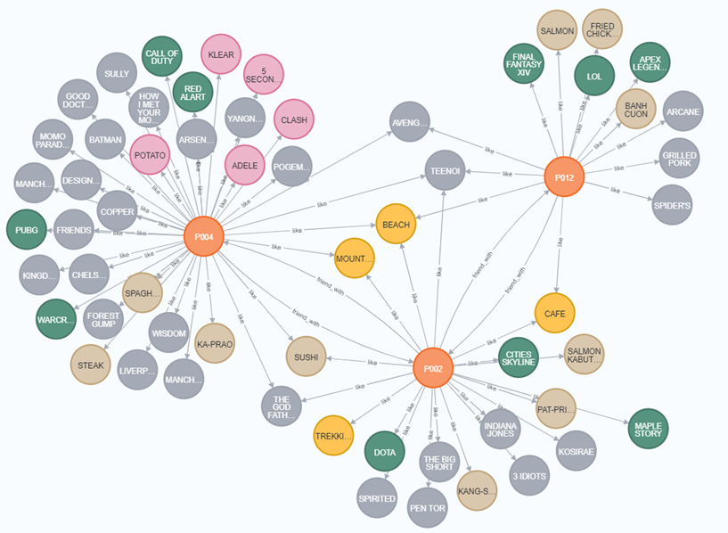

# Social-Network-and-Lifestyle-Recommendation

## 1) Introduction
   This project collect social networks with their favorite and store in the form of knowlegde graph by using Neo4j. Then make a link prediction in terms that you like something. This task we can call a recommendation task base on knowledge graph to find out what people might like.

## 2) Data source  
   We create questionnaire in Google Form to collect about personal preferences including domicile, travel, social media, food, game, football club, buffet restaurant, TV series, movie and actor. The questionnaires were sent to 14 people.
   Next, we cleansing the answers and use the answers to create a knowledge graph. We got 378 unique nodes and 1276 edges with 12 types of edge in knowledge graphs.
   
## 3) Graph database  
   We store the knowledge graph in graph database (GDB) called [Neo4j](https://neo4j.com/). We run python script to query with [cypher](https://neo4j.com/developer/cypher/), Neo4j’s graph query language, on [Neo4j sandbox](https://neo4j.com/sandbox/) to store the knowledge graph and return graph for embadding.  
   - Example graph  
   
   
   
## 4) Link prediction
   We use [AmpliGraph](https://docs.ampligraph.org/en/1.4.0/) to embed nodes and edges in the knowleadge graph by use ComplEx embedding that cover symmetri, antisymmetric and 1-to-N relation.  
   In prediction task, we provide unseen graph include person node with like type edge like to something that is meant to predict whether the person likes that thing or not. We can call this prediction task is "Recommendation task". The prediction results return the score of the unseen graph and the probability which can be used to interpret the likelihood that people like it.
